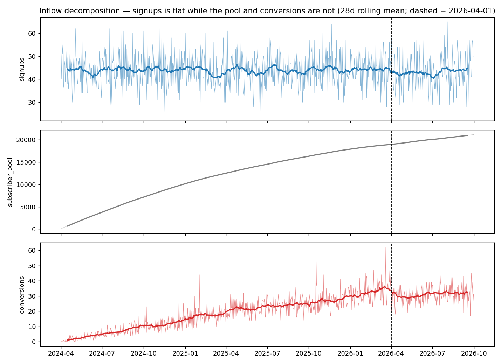
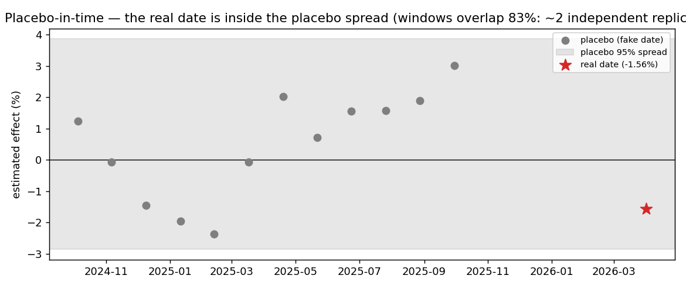

# Did the price hike change signup inflow? — validated null

**Claim [[i-c64a]]:** the 2026-04-01 price increase ([[k-a1f4]]) produced **no
detectable change in daily signup inflow** ([[k-099a]]). Point estimate
**−1.6%**; placebo-calibrated 95% interval **[−4.9%, +1.8%]**. The design's
minimum detectable effect is **±4.8%** at 80% power, so the honest statement is
*"no effect larger than about 5%"* — not *"no effect"*.

This matters beyond curiosity: inflow feeds `subscriber_pool`, which is the
denominator of the governed outcome [[k-77b0]]. Had the hike moved signups, the
conversion effect [[i-3fa2]] would be measuring a denominator shift as well as a
numerator one. It didn't, so [[i-3fa2]] is not contaminated through that channel.

## What the issue asked, and what was actually there

Issue #10 asked to verify "the contract's own claim" that signups are
*"inflow; flat across treatment"*. **That claim was not in the contract.**
`1-data/semantic-layer/conv_rate.yml` never mentions `signups`; the only
description anywhere was `signups — new users that day`, in the task
instruction file, which is agent-facing text and not a governed definition.

So the assumption was real and load-bearing, but ungoverned and untested — the
exact failure mode the semantic layer exists to prevent. This run adds
`1-data/semantic-layer/signups.yml` ([[k-099a]]) and attaches evidence to it
rather than an assertion.

## Method

Interrupted time series on `signups`, the same machinery used for [[i-3fa2]] so
the two are comparable. Counterfactual fit on pre-treatment data only, with the
7-day anticipation guard window the semantic layer requires — the hike was
announced about a week ahead, so those days are contaminated for signups too,
not only for conversions.

**Specification was identified, not assumed.** Every candidate term was tested
for joint significance on the 730-day pre-period against an intercept-only
baseline, and *every one failed*: linear trend (p=0.92), quadratic (p=0.70),
annual Fourier 1 and 2 harmonics (p=0.68, p=0.94), weekly Fourier (p=0.87),
day-of-week dummies (p=0.47). Inflow is white noise around ≈43.9/day
(sd 6.7, dispersion ratio 1.03 — essentially Poisson). No seasonal basis was
added: an insignificant seasonal term is not a safe control, it extrapolates
noise into the counterfactual. A linear trend was retained by pre-registration
anyway, because the counterfactual extrapolates 183 days and "flat forever" is
the stronger claim; intercept-only is reported as a sensitivity.

**Residual gate** (not R²): residual-vs-time r=+0.004, lag-1 ACF −0.012,
Ljung-Box(14) p=0.17, leftover seasonal R²<0.01. All pass. Pre-period R² is
0.001 and is deliberately *not* a gate — this is irreducible count noise, and
the mean structure is what the counterfactual depends on.

**MCMC**: max R-hat 1.004, 0 divergences, min ESS 1401.

## Results

| spec | effect | 95% HDI |
|---|---|---|
| primary (`1 + t`, 7d guard) | −1.56% | [−4.14, +1.03] |
| no guard window | −1.67% | [−3.94, +0.93] |
| 14-day guard window | −1.67% | [−4.35, +0.74] |
| intercept only | −1.53% | [−2.55, −0.40] |
| quadratic trend | −3.31% | [−7.63, +1.50] |
| Poisson (log link) | −1.53% | [−4.23, +1.11] |
| first 30 post days only | −4.21% | — |

The **point estimate is stable at −1.5% to −1.7%** across guard window, model
family, and trend form. The quadratic spec drifts to −3.3% with a much wider
interval, which is what an over-flexible extrapolation does — it is reported,
not hidden.

**Placebo-in-time**, 12 fake dates inside the pre-period, each refit with the
same guard window and the same 183-day scoring horizon: placebo effects range
−2.4% to +3.0% (mean +0.51%, sd 1.71%). The real date sits at z = **−1.21**,
empirical p = **0.25**. The real date is unremarkable against fake ones — which
is the decisive test, and it says there is no effect to find.

**Equivalence:** with a ±5% ROPE, P(effect within ROPE) = **0.978**
(placebo-calibrated). That is what makes this a validated null rather than a
shrug: the effect is bounded, not merely un-rejected.

Signups sit flat through the intervention while `subscriber_pool` grows
smoothly and `conversions` bend at the cutoff. The pool's growth is the
accumulating stock, not an inflow response.

## Caveats — three that bite

**1. The posterior intervals are overconfident by ~1.3×.** CausalPy's
`post_impact` carries *parameter* uncertainty only (its window-average sd equals
σ/√n_pre); it is not a calibrated forecast interval. Across 12 dates where the
answer is known to be zero, the estimator's actual spread was 1.71% against a
posterior sd of 1.32%. Every interval quoted as "calibrated" above uses the
placebo spread. **This is why the intercept-only row appears significant**
([−2.55, −0.40], excluding zero) — that spec drops trend-extrapolation
uncertainty and is the *most* overconfident of the set. It is not evidence of an
effect; calibrated, it sits inside noise like everything else.

**2. The placebo sweep has ~3 independent replicates, not 12.** With a 183-day
scoring window and fake dates 32 days apart, neighbouring placebos share **83%**
of their data. This is why the placebo series drifts smoothly from negative in
winter to positive in late summer — that is serial dependence, *not* an annual
cycle that survived spec selection, and naive correlation tests on those 12
points are invalid. Consequence: the ±4.8% bound is itself imprecise. Fitting
the annual position of the fake dates and asking where the real date should have
landed gives z = −1.32, still unremarkable, so the conclusion does not turn on
this — but the *precision* of the bound is softer than "sd over 12 placebos"
suggests. A 730-day pre-period simply cannot host more than ~3 non-overlapping
183-day windows.

**3. The first 30 post-treatment days show −4.2%**, three times the full-window
estimate. This is the same window where the anticipation cohort distorts
revenue-per-conversion (see `1-data/business-context.md`), and it is within
noise at this sample size — but a short-lived inflow dip that decays is not
excluded by a 183-day average. Anyone asking specifically about launch-window
inflow should not cite [[i-c64a]] as the answer.

## What this does not establish

This is quasi-experimental: the causal reading rests on the counterfactual being
credible, not on randomization. There are no control units in this dataset, so
DiD and synthetic control cannot be run as cross-checks (issue #14). The
estimand is an ATT on *this* business over 2026-04-01..2026-09-30 — not the
effect of price hikes in general, and not a claim about any window shorter than
the one measured.
